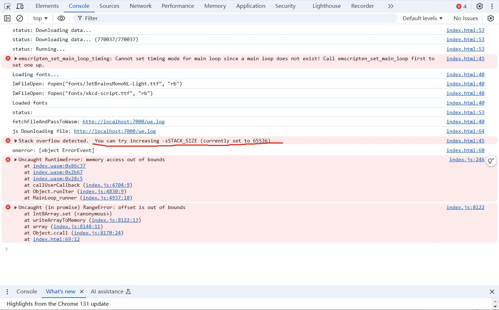

## 内存限制

WebAssembly在浏览器中是作为一个对象存在的，浏览器对单个对象都有内存的限制，目前WebAssembly内存限制主要有两点：

1. 目前WebAssembly在浏览器中最大可用内存是2GB，超出就会提示内存申请错误。
2. 对Stack内存有限制，可以修改MakeFile扩大。


### 1. 2GB内存限制

目前浏览器会限制WebAssembly可用内存为2GB，注意这个是指WebAssembly里面的C++代码最大可用内存为2GB。

这个限制没有办法通过编译配置解决，是写死的。

所以只能尽可能的去优化代码内存占用，用牺牲一定性能，来换取代码的可运行。

例如项目中的一个Log分析网页，需要对单个4GB大小的Log分析，传统的做法就是在JS中下载Log后一次性传入到C++中，然后对每一行进行分析。

4GB的Log文件从JS传递到C++，内存直接爆炸了。

这里就提到另一个浏览器的特性，就是WebAssembly是被看作一个对象，浏览器对单个网页的单个对象有内存限制的，但是一个网页是㛮多个对象的，我们可以在JS中创建多个ArrayBuffer对象来存Log文件，例如申请2个2GB的ArrayBuffer对象，把Log文件存起来。

然后在C++中，每次从ArrayBuffer中取10M内存，来进行分析。

这样就可以牺牲一定的性能(主要是从JS拷贝内存到WebAssembly)，来换取应用的正常运行。

### 2. Stack内存限制

默认限制Stack是1MB，当超出时就会有错误`stack overflow detected,you can trying increasing -sStack_Size`。



按照它的提示，在编译配置里配置大一些就行，例如这里直接配置了1GB：

```MakeFile
LDFLAGS += -s USE_GLFW=3 -s WASM=1 -s ALLOW_MEMORY_GROWTH=1 -s NO_EXIT_RUNTIME=0 -s ASSERTIONS=1 -s "EXPORTED_RUNTIME_METHODS=['ccall', 'cwrap']" -s STACK_SIZE=1gb
```

注意，Stack内存是直接占用WebAssembly 2GB可用内存的，像上面直接配置了1GB，那么其他C++代码可用内存就只剩下1GB了。

当然一般来说不用搞这么大，按照实际需求即可，我一般配置20mb。
